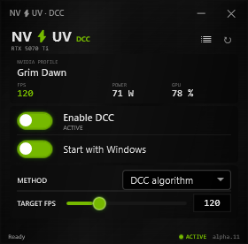

# DCC by NV-UV

**Dynamic Clock Capping for NVIDIA GeForce GPUs.**

This repository currently hosts the experimental **0.1.0-alpha.13 binary-only
Community Preview**. The source code and normal repository development are
planned for the following week under MPL-2.0. DCC is also planned as an
integrated feature in the next NV-UV release.

## What it does

DCC offers efficiency control without requiring a manual GPU clock. DCC's own
adaptive clock controller is the default. NVIDIA Ultra Efficiency remains an
experimental alternative using the driver's internal JPAC/Max-Perf-per-Watt
controller. A hard per-game NVIDIA frame limit is optional and off by default.

- automatic primary NVIDIA GPU selection;
- optional per-game performance logs for FPS, frame times, power, GPU load,
  clocks, selected method/target, and verification state, off by default;
- on-demand comparison ZIP export retaining the latest 30 completed runs per
  game;
- game matching from profiles installed with the NVIDIA driver, gated by a
  foreground process and fresh per-process presentation events;
- no driver mutation for known launchers, desktop applications, browsers,
  overlays, or monitoring tools;
- own Windows ETW FPS collector without overlay or DLL injection;
- DCC-algorithm targets from 20 to 1000 FPS;
- persistent learned profiles per GPU, game executable, and target FPS, reused
  immediately after secure game confirmation;
- immediate release of active GPU control on desktop/browser Alt+Tab, with the
  learned game profile retained for the return;
- default learning `DCC algorithm` and experimental `NVIDIA Ultra Efficiency`
  alternative;
- optional NVIDIA Max Frame Rate limit using the selected 60–400 FPS JPAC target
  in NVIDIA mode and the 20–1000 FPS target with the DCC algorithm;
- `Global` (armed for confirmed games until switched off or Windows restarts)
  and one-session `Per game` activation scope;
- restoration of every DCC-owned efficiency, clock, and frame-limiter change;
- activation history, learned profiles, diagnostics, tray, and emergency reset;
- no RTSS, MSI Afterburner, MAHM, cloud service, or AI model required.

DCC is not undervolting and does not edit the V/F curve.

## Two clearly different methods

- **NVIDIA Ultra Efficiency** is an experimental alternative. It calls NVIDIA's
  internal, undocumented JPAC/Max-Perf-per-Watt algorithm with the selected
  60–400 FPS efficiency target. “Ultra Efficiency” is DCC's descriptive UI
  name, not an official NVIDIA product name. Driver support is not guaranteed.
- **DCC algorithm** is the default and NV-UV's own adaptive controller. It
  learns the lowest sufficient clock, restores performance quickly for heavier
  scenes, and later re-tests lower clocks cautiously.

Without the optional **Frame limit**, NVIDIA Ultra Efficiency applies no hard
cap; the selected FPS value remains JPAC's efficiency target. With the DCC
algorithm, target FPS drives the learning governor. The checkbox adds a
per-game NVIDIA Max Frame Rate cap.

Anyone who also wants to try NVIDIA's official Project G-Assist can install it
from the Discover section of NVIDIA App:
[Project G-Assist](https://www.nvidia.com/en-us/software/nvidia-app/g-assist/).

Windows autostart launches only the normal UI. DCC hardware control always
starts off after a Windows restart and requires manual activation plus UAC.

## Best use cases and clean testing

DCC is most useful when a game has substantial unused GPU performance at the
chosen FPS target: older or lightweight games, indie titles, ARPGs, strategy
games, emulators, capped esports titles, and CPU-limited games. A fully
GPU-bound game that barely reaches its target has little headroom to remove.

For the most efficient control, use exactly one FPS cap matching the DCC target
from the game, NVIDIA driver, or DCC's optional limiter. For the first test,
reset UV/OC to stock and fully close **MSI Afterburner** or any other utility
that can change clocks, voltage, V/F curves, or power limits. **RTSS may remain
running**; DCC does not use its FPS hook. If DCC's optional frame limit is
enabled, avoid a competing RTSS limit.

## Download the alpha

Use the latest GitHub **Pre-release** and read its Community Preview terms,
safety notes, and SHA-256 before testing:

https://github.com/christianp403-spec/nv-uv-dcc/releases/tag/v0.1.0-alpha.13

This archive is a binary Community Preview, not an open-source release.

- [Community Preview terms](COMMUNITY-PREVIEW-TERMS.txt)
- [Alpha.13 preview notes](PREVIEW-NOTES-0.1.0-alpha.13.md)
- [Alpha.12 preview notes](PREVIEW-NOTES-0.1.0-alpha.12.md)
- [Alpha.11 preview notes](PREVIEW-NOTES-0.1.0-alpha.11.md)
- [Detailed Grim Dawn test notes](GRIM-DAWN-RTX5070TI-ALPHA11-TEST.md)

## Early measurements

On an RTX 5070 Ti at 3840 × 2160 (4K) and a 100-FPS target, the existing Eco/UV
configuration was observed around 89–92 W at roughly 2 GHz. With DCC active,
the tested scenes held 100 FPS around 990 MHz and 69–75 W. This is an early
single-system proof of concept, not a standardized benchmark.

At a 120-FPS target on an RTX 5090, early Manor Lords runs measured about 407 W
without DCC control, 367 W with NVIDIA Ultra Efficiency, and 323 W during the
final settled DCC window. In Resident Evil 4, a short stock point measured
408.7 W, versus about 352 W with NVIDIA and 306 W during the final DCC window.
These are non-standardized single-system observations, not general benchmarks.

## Help test it

Useful issue reports include:

- GPU and NVIDIA driver version;
- game, resolution, selected method, and the DCC target or optional cap;
- FPS/frametime stability in both light and demanding scenes;
- board power before and after DCC;
- learned clock;
- activation scope and optional frame-limit state;
- privacy-filtered diagnostic ZIP when something fails.

Please test carefully and expect alpha behavior.

[Share a test result or report a bug](https://github.com/christianp403-spec/nv-uv-dcc/issues/new/choose)
